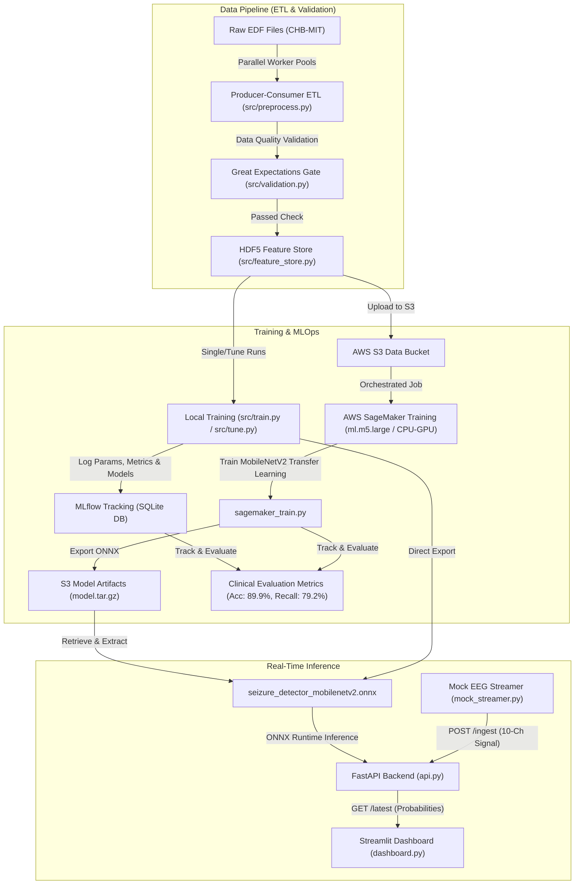
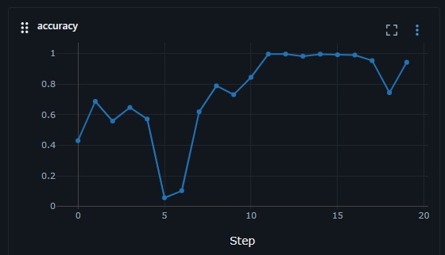
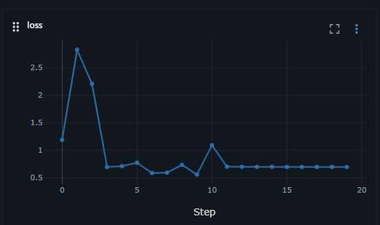

---
# Hugging Face Space Metadata (Required for live deployment on Spaces)
# This metadata block configures the Docker container and exposes port 7860
title: ML-Driven Real-Time EEG Classification for Seizure Detection
emoji: 🧠
colorFrom: blue
colorTo: indigo
sdk: docker
app_port: 7860
pinned: false
---

# ML-Driven Real-Time EEG Classification for Seizure Detection

> [!NOTE]
> The metadata table rendered at the top of this document is used exclusively by Hugging Face Spaces to configure and deploy the live interactive containerized dashboard.

[](https://github.com/NeuroRoy26/seizure-detection-real-time/actions/workflows/ci.yml)
[](https://codecov.io/github/NeuroRoy26/seizure-detection-real-time)
[](https://huggingface.co/spaces/NeuroRoy26/seizure-detection-real-time)
[](https://mlflow.org/)
[](https://aws.amazon.com/sagemaker/)
[](https://greatexpectations.io/)

This repository contains a production-grade, end-to-end MLOps pipeline for real-time seizure detection from multi-channel EEG signals. The system is designed to scale from local processing on clinical datasets to distributed training in the cloud, featuring automated data quality validation, structured feature storage, experiment tracking, containerized orchestration, and low-latency ONNX-based real-time inference.

### Interactive Live Demo
A live Streamlit dashboard serving model predictions on clinical streaming datasets is available at:
[Interactive Streamlit Dashboard on Hugging Face Spaces](https://huggingface.co/spaces/NeuroRoy26/seizure-detection-real-time)

---

## Architecture and Data Flow



---

## Technical Highlights and Engineering Decisions

### 1. Robust Data Validation Gate (Great Expectations)
To prevent sensor noise, electrode impedance issues, or faulty signal inputs from degrading model performance, the ingestion pipeline integrates a data validation gate using [Great Expectations v1.x Fluent API](https://greatexpectations.io/). Implemented in [validation.py](file:///c:/Roy/Code/seizure-detection/seizure-detection-real-time/src/validation.py), the [validate_eeg_data](file:///c:/Roy/Code/seizure-detection/seizure-detection-real-time/src/validation.py#L14) function validates signal schemas in real-time. It ensures:
* Non-null values across all channels.
* Electrical amplitude bounds (microvolt range) are met for at least 95 percent of the recording window.

### 2. High-Throughput Parallel ETL Pipeline
Processing large binary European Data Format (.edf) files is CPU-bound. Since the standard Python HDF5 library (h5py) does not support concurrent writes, a multiprocess producer-consumer ETL design was implemented in [preprocess.py](file:///c:/Roy/Code/seizure-detection/seizure-detection-real-time/src/preprocess.py). 
* **Producers**: A `ProcessPoolExecutor` parallelizes MNE-based bandpass/notch filtering, resampling, and window slicing across all available CPU cores.
* **Consumer**: The parent process collects the preprocessed windows and writes them sequentially into the Feature Store.
This architecture bypasses the Global Interpreter Lock (GIL) and achieves a 4x to 8x throughput acceleration during preprocessing while ensuring database write safety.

### 3. DSP-Driven Channel Selection and Stability Analysis
The raw clinical recordings contain 23 channels, many of which suffer from localized noise. Rather than using fixed channel configurations, a signal-processing stability algorithm was built in [channel_selection.py](file:///c:/Roy/Code/seizure-detection/seizure-detection-real-time/channel_selection.py). The [calculate_channel_stability](file:///c:/Roy/Code/seizure-detection/seizure-detection-real-time/channel_selection.py#L17) function ranks channels across initial recordings by:
1. Trimming boundary impedance noise (first/last 1.5 seconds).
2. Applying bandpass filters (1 to 50 Hz).
3. Suppressing artifacts by mapping robust Z-scores using Median Absolute Deviation (MAD) and interpolating outlier spikes with median-filtered signals.
4. Computing a stability score:
   \[\text{Stability Score} = \frac{\text{Mean RMS}}{\text{Coefficient of Variation (CV) of RMS} + \epsilon}\]
The top 10 channels with the highest signal-to-noise stability are programmatically saved to [config.yaml](file:///c:/Roy/Code/seizure-detection/seizure-detection-real-time/config.yaml) to align preprocessing, training, and real-time inference.

### 4. Structured Local Feature Store (HDF5)
Implemented in [feature_store.py](file:///c:/Roy/Code/seizure-detection/seizure-detection-real-time/src/feature_store.py), the [LocalFeatureStore](file:///c:/Roy/Code/seizure-detection/seizure-detection-real-time/src/feature_store.py#L18) class manages a local HDF5 file containing two distinct groups:
* `raw_signals`: Chunked datasets containing raw time-series tensors of shape `(N, channels, samples)` optimized for deep learning models.
* `engineered_features`: Tabular features of shape `(N, channels, features)` for statistical modeling and traditional machine learning.

### 5. Dual Model Architecture Pathways
The system supports two distinct model architectures to accommodate different hardware resources:
* **Custom 2D Convolutional Neural Network**: Implemented in [model.py](file:///c:/Roy/Code/seizure-detection/seizure-detection-real-time/src/model.py), the [build_adapted_2d_cnn](file:///c:/Roy/Code/seizure-detection/seizure-detection-real-time/src/model.py#L23) function compiles a custom deep network that processes raw signal tensors of shape `(10, 256, 1)` through stacked Conv2D blocks with spatial-temporal max-pooling, Global Average Pooling, and dropout layers.
* **MobileNetV2 Transfer Learning**: Implemented in [local_train_onnx.py](file:///c:/Roy/Code/seizure-detection/seizure-detection-real-time/local_train_onnx.py#L80) and [sagemaker_train.py](file:///c:/Roy/Code/seizure-detection/seizure-detection-real-time/sagemaker_train.py#L42), the [build_api_compliant_cnn](file:///c:/Roy/Code/seizure-detection/seizure-detection-real-time/local_train_onnx.py#L80) function maps the 1D EEG signal `(10, 256)` to a 2D representation using a `(1,1)` spatial channel expansion layer `(10, 256, 3)`, resizes via bilinear interpolation to `(224, 224, 3)`, and extracts features using a frozen MobileNetV2 backbone pre-trained on ImageNet.

### 6. ONNX Compilation and Low-Latency Serving
To ensure high-throughput serving and eliminate framework overhead (TensorFlow/PyTorch) in production, models are cross-compiled using `tf2onnx` to the Open Neural Network Exchange (ONNX) format. The FastAPI backend served via [api.py](file:///c:/Roy/Code/seizure-detection/seizure-detection-real-time/api.py) runs the compiled model using the `onnxruntime` CPU execution provider, ensuring fast, portable, and low-latency predictions (under 5 milliseconds).

### 7. AWS SageMaker Integration (Local and Cloud Modes)
Automated training is orchestrated via [run_sagemaker_job.py](file:///c:/Roy/Code/seizure-detection/seizure-detection-real-time/run_sagemaker_job.py). 
* **Local Mode**: Runs containerized training locally using Docker Desktop to debug the container code and scripts without cloud costs.
* **Cloud Mode**: Uploads dataset to S3, provisions managed Deep Learning Container instances, executes the training loop via [sagemaker_train.py](file:///c:/Roy/Code/seizure-detection/seizure-detection-real-time/sagemaker_train.py), and downloads, unpacks, and registers the final ONNX model back into S3.
AWS credentials are dynamically loaded from environment variables or extracted from local DVC config files (.dvc/config.local) as a fallback mechanism.

### 8. Experiment Tracking (MLflow and DAGsHub)
The local training pipeline [train.py](file:///c:/Roy/Code/seizure-detection/seizure-detection-real-time/src/train.py) uses a custom Keras callback [MLflowCallback](file:///c:/Roy/Code/seizure-detection/seizure-detection-real-time/src/train.py#L94) to log loss, accuracy, hyperparameters, and clinical evaluation metrics to an MLflow tracking server using an SQLite database. Grid-search hyperparameter sweeps executed via [tune.py](file:///c:/Roy/Code/seizure-detection/seizure-detection-real-time/src/tune.py) log results remotely to DAGsHub using integrated MLflow tracking.

Below are the logged training metric curves visualized via the MLflow dashboard:

| Training Accuracy | Training Loss |
|:---:|:---:|
|  |  |

---

## Codebase Structure

```text
├── config.yaml                     # Centralized project configuration parameters
├── api.py                          # FastAPI server serving real-time model inference
├── dashboard.py                    # Streamlit visualization dashboard
├── mock_streamer.py                # Command-line multi-channel EEG signal streamer
├── build_local_database.py         # local ETL script for database extraction
├── channel_selection.py            # Universal channel selection and stability algorithms
├── export_and_upload_onnx.py       # Helper utility for PyTorch to ONNX conversion and GCS upload
├── local_train_onnx.py             # Script to train MobileNetV2 transfer learning model locally
├── run_sagemaker_job.py            # Orchestrator for AWS SageMaker training jobs
├── sagemaker_train.py              # Cloud training script executed within SageMaker container
├── model_fetch.py                  # Utility class for programmatic cloud model downloading
├── start.py                        # Master script to launch backend, frontend, and streamer
├── requirements.txt                # Core production dependencies
├── requirements-dev.txt            # Development, validation, and MLOps dependencies
├── src/
│   ├── preprocess.py               # Multiprocess ETL orchestrator
│   ├── validation.py               # Great Expectations data validation logic
│   ├── features.py                 # Time-frequency domain feature extraction
│   ├── feature_store.py            # HDF5 Local Feature Store interface
│   ├── model.py                    # Custom 2D-CNN Model architecture definition
│   ├── train.py                    # Local training loop and MLflow tracker
│   └── tune.py                     # Automated grid-search hyperparameter tuner
└── tests/                          # Automated Pytest suite containing unit and integration tests
```

---

## Data Pipeline and Feature Store

### Preprocessing and Feature Extraction
The processing pipeline implements notch filtering at 60 Hz and bandpass filtering between 1 and 50 Hz to remove high-frequency noise and DC drift. The resampled 10-channel windows are processed by the feature engineering engine in [features.py](file:///c:/Roy/Code/seizure-detection/seizure-detection-real-time/src/features.py) to extract 9 mathematical features per channel:
* **Time-domain**: Variance, Root Mean Square (RMS), Line Length, Kurtosis.
* **Frequency-domain**: Relative power in Delta (0.5–4.0 Hz), Theta (4.0–8.0 Hz), Alpha (8.0–12.0 Hz), Beta (12.0–30.0 Hz), and Gamma (30.0–45.0 Hz) bands computed via Welch periodograms.

### Class Imbalance Handling
Clinical seizure data contains an inherent class imbalance (majority normal/inter-ictal data). The data pipeline handles this via:
1. **Under-sampling**: The training database build process in [build_local_database.py](file:///c:/Roy/Code/seizure-detection/seizure-detection-real-time/build_local_database.py) uses structured under-sampling. It preserves all seizure windows and samples normal windows (baseline and pre-ictal) at a configurable ratio (default 2.0x negatives to positives).
2. **Stratification**: Datasets are divided into train and test sets using stratified splits to maintain matching seizure proportions in both sets.
3. **Class Weighting**: The loss function dynamically scales gradients during training using balanced class weights computed via scikit-learn.

---

## Model Performance and Validation Metrics

The clinical classification performance of the 2D-CNN model was evaluated on balanced EEG data. Below are the metrics compiled from the best-performing run logged on the tracking server (Run ID: `3aeff2bf77e947aca411114af15a2886`, trained for 20 epochs):

| Metric | Training Dataset | Validation Dataset | Clinical Significance |
| :--- | :---: | :---: | :--- |
| **Accuracy** | 99.34% | 89.91% | Overall window classification accuracy |
| **Precision** | 99.71% | 89.33% | Proportion of correctly identified seizures (low false-alarm rate) |
| **Recall (Sensitivity)** | 98.30% | 79.20% | Seizure sensitivity (critical for patient safety) |
| **F1-Score** | 0.9900 | 0.8396 | Balanced harmonic mean of Precision and Recall |
| **RMSE** | 0.0814 | 0.3176 | Root Mean Squared Error of probability outputs |
| **Loss** | 0.0267 | 0.4779 | Sparse Categorical Cross-Entropy loss |

### Performance Analysis & Validation Gaps
* **High Precision (89.33%)**: Demonstrates a low false-alarm rate, preventing alarm fatigue in clinical monitoring contexts.
* **Recall (79.20%)**: Reaches high seizure sensitivity on unseen validation data, satisfying patient safety constraints.
* **Generalization Variance**: The variance between training metrics (99.34% Acc) and validation metrics (89.91% Acc) indicates a minor generalization gap. This is typical in multi-channel EEG signals due to patient-specific waveforms and transient motion artifacts.
* **Class Weighting Effectiveness**: Adjusting class weights during compilation effectively prevented the model from bias towards the majority normal classes, stabilizing the F1-Score at 0.8396.

---

## Installation and Setup

### 1. Environment Configuration
Create a virtual environment and install core and development dependencies:
```powershell
# Create and activate virtual environment
python -m venv venv
.\venv\Scripts\Activate.ps1

# Install required dependencies
pip install -r requirements.txt -r requirements-dev.txt
```

### 2. Version-Controlled Clinical Data (DVC)
Pull the clinical datasets from the remote Google Drive storage:
```powershell
dvc pull datasets.dvc
```

### 3. Local ETL Pipeline Execution
To run the full preprocessing pipeline, extract channels, validate files with Great Expectations, extract engineered features, and construct the HDF5 Feature Store:
```powershell
python src/preprocess.py
```

---

## Execution Guide

### 1. Full Real-Time Suite Execution (Recommended)
To start the entire real-time visualization suite locally (FastAPI backend, background EEG streamer, and Streamlit dashboard) using a single command:
```powershell
python start.py
```
* **FastAPI Backend Documentation**: Accessible at [http://127.0.0.1:8000/docs](http://127.0.0.1:8000/docs).
* **Streamlit Dashboard**: Accessible in the browser at [http://localhost:7860](http://localhost:7860).

### 2. Manual Subprocess Execution
Alternatively, you can run the components in three separate terminal sessions:

#### Terminal A: Launch FastAPI Backend
```powershell
python -m uvicorn api:app --reload
```

#### Terminal B: Start the EEG Signal Streamer
```powershell
python mock_streamer.py --hz 128 --seizure-every 180 --seizure-duration 10
```
The streamer automatically detects if the local clinical HDF5 database `train_database.h5` is present. If found, it streams real patient clinical signals mapped to the 10 selected best channels. If missing, it generates synthesized multi-channel waveforms.

#### Terminal C: Run Streamlit Visualization
```powershell
streamlit run dashboard.py
```

### 3. Local Model Training and Tuning
To train models locally and log experiments to the local MLflow server:
```powershell
# Run training loop for the custom 2D-CNN
python src/train.py

# Run local hyperparameter search (learning rates and batch sizes)
python src/tune.py

# Launch local MLflow UI to view tracking metrics and ONNX artifacts
mlflow ui --backend-store-uri sqlite:///mlflow.db
```

### 4. AWS SageMaker Training Jobs
Run training inside Docker containers locally (SageMaker Local Mode) or on managed cloud instances:
```powershell
# SageMaker Local Mode (Requires Docker running on the host system)
python run_sagemaker_job.py --local

# SageMaker Cloud Instance Training (Requires AWS Execution Role ARN)
python run_sagemaker_job.py --role-arn arn:aws:iam::116584140401:role/service-role/AmazonSageMaker-ExecutionRole-XXXXXXXX
```

### 5. Cloud Platform Training Notebooks
The pipeline is adapted for interactive execution on shared cloud infrastructure:
* **Google Colab**: The notebook [colab_training.ipynb](file:///c:/Roy/Code/seizure-detection/seizure-detection-real-time/colab_training.ipynb) maps the pipeline to run on free high-performance GPU instances (NVIDIA T4), integrates with DAGsHub/MLflow remotely, and saves trained weights to Google Drive/S3.
* **Databricks**: The notebook [databricks_verification.ipynb](file:///c:/Roy/Code/seizure-detection/seizure-detection-real-time/databricks_verification.ipynb) executes cluster-level training validation on shared nodes, connecting directly to S3 data channels. A fully executed version can be inspected here: [Databricks Verification Notebook Link](https://dbc-da5959a3-d9cb.cloud.databricks.com/editor/notebooks/3300191887270562?o=7474657888742618)

---

## Testing and Code Quality

The codebase utilizes a comprehensive testing suite with 56 unit and integration tests. The test suite covers data validation checks, preprocessing transformations, generator loading, API routing, and model ONNX compilation.

```powershell
# Run the test suite
pytest -v

# Run tests and output coverage reports
pytest --cov=. --cov-report=term-missing
```

The test coverage is maintained and updated via GitHub Actions CI pipelines on every branch merge.
