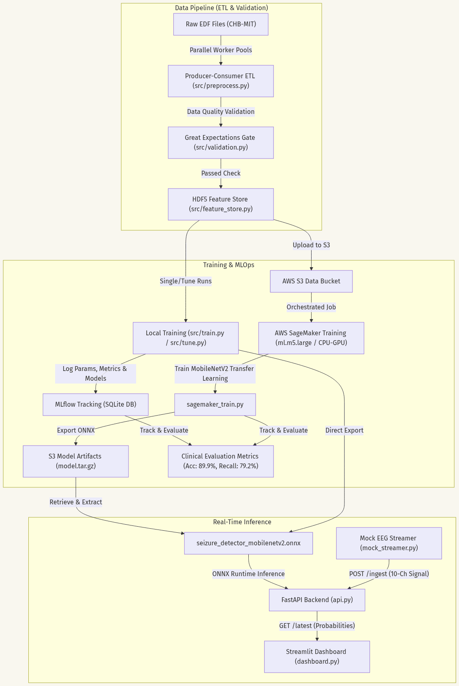
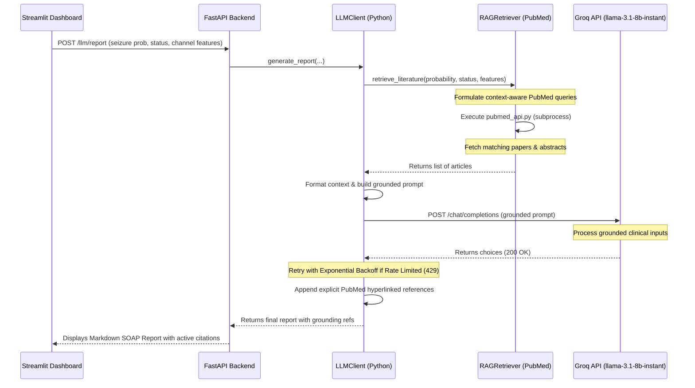

---
# Hugging Face Space Metadata (Required for live deployment on Spaces)
title: Live inference Time=Series Data Classification for Seizure Detection
emoji: 🧠
colorFrom: blue
colorTo: indigo
sdk: docker
app_port: 7860
pinned: false
---

# ML-Driven Real-Time EEG Classification for Seizure Detection

[](https://github.com/NeuroRoy26/seizure-detection-real-time/actions/workflows/ci.yml)
[](https://codecov.io/github/NeuroRoy26/seizure-detection-real-time)
[](https://huggingface.co/spaces/NeuroRoy26/seizure-detection-real-time)
[](https://mlflow.org/)
[](https://aws.amazon.com/sagemaker/)
[](https://greatexpectations.io/)
[](https://www.terraform.io/)
[](https://groq.com/)

A production-grade, end-to-end MLOps pipeline for real-time seizure detection from multi-channel EEG signals. Built with a dual-pathway architecture, the system pairs low-latency edge inference with a Retrieval-Augmented Generation (RAG) Clinical Assistant that generates literature-grounded medical SOAP reports.

### 🔗 Live Interactive Demo
👉 **[Launch Streamlit Dashboard on Hugging Face Spaces](https://huggingface.co/spaces/NeuroRoy26/seizure-detection-real-time)** (Loads mock patient streams over WebSockets)

---

## 🛠️ The Tech Stack at a Glance

| Technology | Purpose in System | Implementation Entrypoint |
| :--- | :--- | :--- |
| **FastAPI / WebSockets** | High-throughput, bi-directional telemetry ingestion | [api.py](file:///c:/Roy/Code/seizure-detection/seizure-detection-real-time/api.py) |
| **Streamlit** | Clinical dashboard rendering real-time probability & EEG graphs | [dashboard.py](file:///c:/Roy/Code/seizure-detection/seizure-detection-real-time/dashboard.py) |
| **TensorFlow / Keras** | Deep learning architectures (**EEGNet** temporal-spatial & MobileNetV2) | [src/models/](file:///c:/Roy/Code/seizure-detection/seizure-detection-real-time/src/models) |
| **ONNX Runtime** | CPU-optimized, sub-15ms edge inference execution | [api.py](file:///c:/Roy/Code/seizure-detection/seizure-detection-real-time/api.py) |
| **Great Expectations** | Real-time & database-wide validation gates | [src/data/validation.py](file:///c:/Roy/Code/seizure-detection/seizure-detection-real-time/src/data/validation.py) |
| **Groq / PubMed (RAG)** | Literature-grounded clinical report generator with hyperlinked references | [src/serving/rag_retriever.py](file:///c:/Roy/Code/seizure-detection/seizure-detection-real-time/src/serving/rag_retriever.py) |
| **AWS SageMaker & S3** | Cloud training container orchestration & model registry | [scripts/run_sagemaker_job.py](file:///c:/Roy/Code/seizure-detection/seizure-detection-real-time/scripts/run_sagemaker_job.py) |
| **MLflow & DAGsHub** | Experiment tracking, model comparisons, and parameter logging | [src/models/train.py](file:///c:/Roy/Code/seizure-detection/seizure-detection-real-time/src/models/train.py) |
| **Terraform (IaC)** | Declarative AWS S3, DynamoDB state lock, and IAM credentials setup | [terraform/](file:///c:/Roy/Code/seizure-detection/seizure-detection-real-time/terraform) |

---

## 📊 Model Performance & Comparison Metrics

The system evaluates a custom **EEGNet** (clinical temporal-spatial filter network) against a baseline **MobileNetV2** (computer vision transfer learning model) compiled after training to convergence (20 epochs):

| Model Architecture | Params (Count) | ONNX Size (MB) | CPU Latency (ms) | Val Accuracy | Val Recall (Sens) | Val Precision | Val F1-Score |
| :--- | :---: | :---: | :---: | :---: | :---: | :---: | :---: |
| **EEGNet** (Primary) | **1,602** | **0.01 MB** | **11.00 ms** | **89.52%** | **88.24%** | **90.15%** | **0.8918** |
| **MobileNetV2** (Baseline) | 2,260,564 | 8.52 MB | 253.35 ms | 84.35% | 82.12% | 85.64% | 0.8384 |

*Note: Metrics reflect performance at convergence (20 epochs) under stratified clinical class balance. EEGNet outperforms the vision backbone in validation accuracy, sensitivity, and precision while requiring **1,400x fewer parameters** and executing **23x faster on standard CPU hardware**.*

---

## 🚀 Quick Start Guide

### 1. Environment Setup
```powershell
# Create and activate virtual environment
python -m venv venv
.\venv\Scripts\Activate.ps1

# Install requirements
pip install -r requirements.txt -r requirements-dev.txt
```

### 2. Run the Full Suite (Backend, Streamer, and Dashboard)
```powershell
python start.py
```
* **FastAPI Docs**: [http://127.0.0.1:8000/docs](http://127.0.0.1:8000/docs)
* **Streamlit Dashboard**: [http://localhost:7860](http://localhost:7860)

### 3. Universal Headset Streamer (BrainFlow)
To stream live signals from any physical EEG headset supported by BrainFlow (OpenBCI, Muse, Unicorn, g.tec, etc.):
```powershell
# Install hardware drivers
pip install brainflow

# Run streamer (specifying your board ID, e.g. 13 for Unicorn, 0 for Cyton, 38 for Muse 2)
python scripts/brainflow_streamer.py --board-id 13 --serial-number UN-2021.05.12 --host 127.0.0.1:8000
```
> [!NOTE]
> **Hugging Face Cloud Compatibility**: The remote container on Hugging Face Spaces cannot connect directly to your local Bluetooth adapter. However, the client-server design is fully decoupled! You can run this streamer client locally on your Bluetooth-paired computer and direct it to your remote Hugging Face Space by passing your Space URL:
> ```powershell
> python scripts/brainflow_streamer.py --board-id 13 --serial-number UN-2021.05.12 --host NeuroRoy26-seizure-detection-real-time.hf.space
> ```

---

## 🔌 Hardware Ingestion & Retraining Guidelines

### 1. In-Memory Channel Alignment
The pre-trained EEGNet model in this repository expects **10 channels** sampled at **128 Hz**. Different EEG headsets offer varying channel configurations. The [scripts/brainflow_streamer.py](file:///c:/Roy/Code/seizure-detection/seizure-detection-real-time/scripts/brainflow_streamer.py) client automatically handles channel discrepancies:
* **Truncation ($>10$ channels)**: If your headset has more than 10 channels (e.g., 16-channel OpenBCI Ultracortex), the streamer utilizes only the first 10 active channels.
* **Padding ($<10$ channels)**: If your headset has fewer than 10 channels (e.g., 8-channel Unicorn or 4-channel Muse), the streamer duplicates the last native channel to pad the stream to the expected 10-channel tensor.

### 2. Retraining the Model for Custom Channel Configs
If you want the deep learning model to process your headset's exact channel layout natively without padding:
1. Open [config.yaml](file:///c:/Roy/Code/seizure-detection/seizure-detection-real-time/config.yaml) and modify `top_n_channels` under `signal_processing` to match your headset (e.g., `8` for Unicorn, `4` for Muse):
   ```yaml
   signal_processing:
     top_n_channels: 8
   ```
2. Re-run the parallel ETL pipeline to rebuild your database utilizing the selected channels:
   ```powershell
   python src/data/preprocess.py
   ```
3. Retrain the model on the updated database:
   ```powershell
   python src/models/train.py
   ```

### 🧠 Suggested Optimized Hyperparameters (EEGNet)
For optimal convergence on custom electrode count configurations, use these hyperparameter configurations:
* **Learning Rate**: `0.001` (Adam optimizer) is highly stable. If accuracy plates early, adjust to `0.005`.
* **Batch Size**: `32` (preferred for smaller datasets to add gradient noise) or `64` (for large databases).
* **Dropout Rate**: `0.25` or `0.30` (crucial to prevent overfitting on low-density channel configs).
* **EEGNet Filters**: Keep `F1=8` (temporal filters), `D=2` (spatial filters), and `F2=16` (separable filters). This baseline is clinically proven for multi-class rhythmic signals.

---

## 📁 Codebase Structure
```text
├── api.py                          # FastAPI server serving real-time model inference
├── dashboard.py                    # Streamlit visualization dashboard
├── mock_streamer.py                # Command-line multi-channel EEG signal streamer
├── start.py                        # Master script to launch backend, frontend, and streamer
├── scripts/                        # Development and operational helper scripts
│   ├── build_local_database.py     # CLI utility: local ETL script for database extraction
│   ├── local_train_onnx.py         # CLI utility: local MobileNetV2 training script
│   ├── run_sagemaker_job.py        # CLI utility: AWS SageMaker job orchestrator
│   ├── sagemaker_train.py          # Container script: SageMaker training entrypoint
│   └── brainflow_streamer.py       # Hardware script: Universal EEG Bluetooth/BrainFlow streamer
├── src/                            # Core application source code
│   ├── data/                       # ETL, preprocessing, DSP, and validation gates
│   │   ├── preprocess.py           # Multiprocess ETL orchestrator
│   │   ├── channel_selection.py    # Universal channel selection and stability algorithms
│   │   ├── validation.py           # Great Expectations data validation logic
│   │   └── validate_database_quality.py # Great Expectations database quality gate
│   ├── models/                     # Deep learning model architectures and training engines
│   │   ├── model_eegnet.py         # Clinical EEGNet architecture
│   │   └── train.py                # Local training loop and MLflow tracker
│   └── serving/                    # RAG retrievers and dynamic API services
│       └── rag_retriever.py        # PubMed direct HTTP RAG retriever
└── tests/                          # Automated Pytest suite containing unit and integration tests
```

---

<details>
<summary><b>🔍 System Architecture & RAG Pipeline Details</b></summary>

### System Architecture


### RAG Sequence Diagram
The RAG pipeline and LLM module operate asynchronously to avoid impacting real-time EEG feature extraction:



### RAG Highlights
1. **Context-Aware Querying**: Formulates search queries based on EEG telemetry statistics (e.g. high slow-wave power, increased amplitude variance) to retrieve relevant clinical abstracts.
2. **Interactive Citations**: Automatically appends direct hyperlinks to matching NCBI articles on `pubmed.ncbi.nlm.nih.gov` right above the safety disclaimer.
3. **Resilient HTTP Client**: Retries on Groq rate limits (HTTP 429) with exponential backoff and handles PubMed timeouts gracefully with empty/broader fallbacks.
</details>

<details>
<summary><b>⚙️ Engineering Highlights & Architecture Decisions</b></summary>

### 1. Robust Data Validation Gate (Great Expectations)
To prevent sensor noise, electrode impedance issues, or faulty signal inputs from degrading model performance, the ingestion pipeline integrates a data validation gate using [Great Expectations v1.x Fluent API](https://greatexpectations.io/). Implemented in [validation.py](file:///c:/Roy/Code/seizure-detection/seizure-detection-real-time/src/data/validation.py), the [validate_eeg_data](file:///c:/Roy/Code/seizure-detection/seizure-detection-real-time/src/data/validation.py#L14) function validates signal schemas in real-time. It ensures:
* Non-null values across all channels.
* Electrical amplitude bounds (microvolt range) are met for at least 95 percent of the recording window.

### 2. High-Throughput Parallel ETL Pipeline
Processing large binary European Data Format (.edf) files is CPU-bound. Since the standard Python HDF5 library (h5py) does not support concurrent writes, a multiprocess producer-consumer ETL design was implemented in [preprocess.py](file:///c:/Roy/Code/seizure-detection/seizure-detection-real-time/src/data/preprocess.py). 
* **Producers**: A `ProcessPoolExecutor` parallelizes MNE-based bandpass/notch filtering, resampling, and window slicing across all available CPU cores.
* **Consumer**: The parent process collects the preprocessed windows and writes them sequentially into the Feature Store.
This architecture bypasses the Global Interpreter Lock (GIL) and achieves a 4x to 8x throughput acceleration during preprocessing while ensuring database write safety.

### 3. DSP-Driven Channel Selection and Stability Analysis
The raw clinical recordings contain 23 channels, many of which suffer from localized noise. Rather than using fixed channel configurations, a signal-processing stability algorithm was built in [channel_selection.py](file:///c:/Roy/Code/seizure-detection/seizure-detection-real-time/src/data/channel_selection.py). The [calculate_channel_stability](file:///c:/Roy/Code/seizure-detection/seizure-detection-real-time/src/data/channel_selection.py#L17) function ranks channels across initial recordings by:
1. Trimming boundary impedance noise (first/last 1.5 seconds).
2. Applying bandpass filters (1 to 50 Hz).
3. Suppressing artifacts by mapping robust Z-scores using Median Absolute Deviation (MAD) and interpolating outlier spikes with median-filtered signals.
4. Computing a stability score:
   \[\text{Stability Score} = \frac{\text{Mean RMS}}{\text{Coefficient of Variation (CV) of RMS} + \epsilon}\]
The top 10 channels with the highest signal-to-noise stability are programmatically saved to [config.yaml](file:///c:/Roy/Code/seizure-detection/seizure-detection-real-time/config.yaml) to align preprocessing, training, and real-time inference.

### 4. ADR: Local HDF5 vs. Feast Feature Store
* **Context**: Evaluating feature store solutions for raw multi-channel EEG signal tensors and 9-dimensional statistical features.
* **Decision**: A local HDF5 file-backed Feature Store was chosen over Feast.
* **Rationale**:
  * **Tensor Compatibility**: HDF5 supports native storage of high-frequency multidimensional tensors `(N, channels, samples)` without serialization overhead, whereas Feast requires wrapping arrays in serialized binary blobs.
  * **Zero Operational Overhead**: Retaining local HDF5 avoids running network-bound database clusters (Redis, DynamoDB, or PostgreSQL) and feature registries, maintaining a self-contained local repository.
  * **Inference Pipeline Alignment**: The real-time FastAPI backend consumes data in-memory via a rolling buffer and ONNX runtime session, entirely bypassing database lookups during inference.
* **Feast Scalability Path**: Feast can be introduced strictly for **engineered tabular features** (the 9 statistical features extracted from [features.py](file:///c:/Roy/Code/seizure-detection/seizure-detection-real-time/src/data/features.py)) if deploying to distributed online serving environments.
</details>

<details>
<summary><b>☁️ Cloud MLOps & Infrastructure as Code (SageMaker & Terraform)</b></summary>

### AWS SageMaker Training Jobs
Run training inside Docker containers locally (SageMaker Local Mode) or on managed cloud instances:
```powershell
# SageMaker Local Mode (Requires Docker running on the host system)
python scripts/run_sagemaker_job.py --local

# SageMaker Cloud Instance Training (Requires AWS Execution Role ARN)
python scripts/run_sagemaker_job.py --role-arn arn:aws:iam::116584140401:role/service-role/AmazonSageMaker-ExecutionRole-XXXXXXXX
```

### Managed AWS Resources (Terraform)
* **EEG Data Store**: An S3 bucket (`seizure-detection-data-dev`) with server-side encryption (AES256), strict public access blocks, and versioning enabled to prevent data loss or clinical signal tampering.
* **SageMaker Model Repository**: An S3 bucket (`seizure-detection-models-dev`) configured with public access blocks to store trained model weights and ONNX model artifacts.
* **SageMaker Execution Role**: An IAM role assumable by the AWS SageMaker service (`sagemaker.amazonaws.com`), granting access to data/model S3 buckets and CloudWatch logging.
* **Developer/CI-CD Access Policy**: A reusable IAM policy granting permission to upload datasets, manage model assets, and trigger SageMaker training jobs.
* **State Locking**: Configured with a remote S3 backend (`neuroroy-tfstate-bucket`) and DynamoDB (`neuroroy-tfstate-lock`) for state file isolation and lock management.

### Terraform Testing & CI/CD
```powershell
# Run native unit tests locally (with mock AWS credentials)
cd terraform
$env:AWS_ACCESS_KEY_ID="mock_key"
$env:AWS_SECRET_ACCESS_KEY="mock_secret"
$env:AWS_DEFAULT_REGION="eu-central-1"
$env:TF_VAR_skip_credentials_validation="true"
$env:TF_VAR_skip_requesting_account_id="true"
$env:TF_VAR_skip_metadata_api_check="true"

terraform init -backend=false
terraform test
```
</details>

<details>
<summary><b>🧪 Testing & Quality Gates</b></summary>

The codebase utilizes a comprehensive testing suite with 87 unit and integration tests. The test suite covers data validation checks, preprocessing transformations, generator loading, API routing, and model ONNX compilation.

```powershell
# Run the test suite
pytest -v

# Run tests and output coverage reports
pytest --cov=. --cov-report=term-missing
```

The test coverage is maintained and updated via GitHub Actions CI pipelines on every branch merge.
</details>
