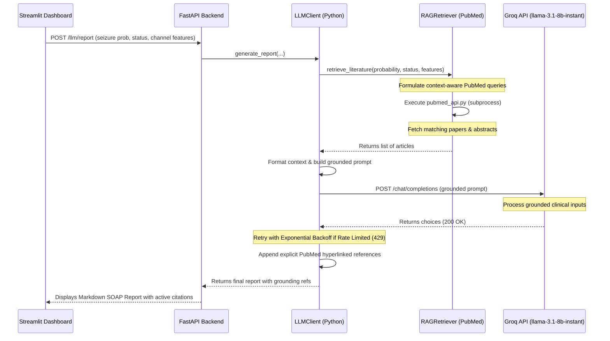

---
# Hugging Face Space Metadata (Required for live deployment on Spaces)
# This metadata block configures the Docker container and exposes port 7860
title: ML-Driven Real-Time EEG Classification for Seizure Detection
emoji: 🧠
colorFrom: blue
colorTo: indigo
sdk: docker
app_port: 7860
pinned: false
---

# ML-Driven Real-Time EEG Classification for Seizure Detection

> [!NOTE]
> The metadata table rendered at the top of this document is used exclusively by Hugging Face Spaces to configure and deploy the live interactive containerized dashboard.

[](https://github.com/NeuroRoy26/seizure-detection-real-time/actions/workflows/ci.yml)
[](https://codecov.io/github/NeuroRoy26/seizure-detection-real-time)
[](https://huggingface.co/spaces/NeuroRoy26/seizure-detection-real-time)
[](https://mlflow.org/)
[](https://aws.amazon.com/sagemaker/)
[](https://greatexpectations.io/)
[](https://www.terraform.io/)
[](https://groq.com/)

This repository contains a production-grade, end-to-end MLOps pipeline for real-time seizure detection from multi-channel EEG signals. The system is designed to scale from local processing on clinical datasets to distributed training in the cloud, featuring automated data quality validation, structured feature storage, experiment tracking, containerized orchestration, low-latency ONNX-based real-time inference, and a Groq-powered LLM Clinical Assistant for real-time SOAP report generation and feature explanation—all managed within an Infrastructure-as-Code framework.

### Interactive Live Demo
A live Streamlit dashboard serving model predictions on clinical streaming datasets is available at:
[Interactive Streamlit Dashboard on Hugging Face Spaces](https://huggingface.co/spaces/NeuroRoy26/seizure-detection-real-time)

---

## Architecture and Data Flow


The project leverages a dual-pathway architecture:
1. **Core MLOps Pipeline**: Raw multi-channel EEG signals are validated (Great Expectations), preprocessed concurrently, and stored locally in HDF5. The training pipeline outputs optimized ONNX models deployed to Hugging Face Spaces for sub-second inference.
2. **AI Clinical Assistant Layer**: Inference outputs and EEG telemetry features are processed through a Retrieval-Augmented Generation (RAG) pipeline. It queries PubMed to retrieve relevant medical literature, grounding the generated clinical reports in scientific evidence. The grounded prompt is routed to a Groq-hosted LLM to generate structured clinical reports with hyperlinked citations.

---

## AI Clinical Assistant and Reporting with RAG Grounding (Groq LLM & PubMed)

To aid clinical neurophysiologists in telemetry assessment and SOAP report generation, the system features an evidence-based Retrieval-Augmented Generation (RAG) execution layer. When a report is requested, the system automatically fetches relevant medical literature from the PubMed database to ground the LLM's assessment.

### 📐 System Architecture & Data Flow
The RAG pipeline and LLM module operate asynchronously to avoid impacting real-time EEG feature extraction:



### 🛠️ Key Technical Highlights
1. **Evidence-Grounded RAG Architecture**: Dynamically formulates PubMed search queries based on EEG telemetry statistics (such as high slow-wave delta/theta power, increased amplitude variance, or high seizure probability), retrieve relevant abstracts, and injects them as prompt context.
2. **Interactive Citations & Reference Lists**: Instructs the LLM to cite referenced papers via `[PMID: XXX]`. It also automatically appends direct hyperlinks to the NCBI articles at `pubmed.ncbi.nlm.nih.gov` right above the safety disclaimer.
3. **Zero-Dependency Local Credentials Isolation**: Stored in a local `.env` file and excluded from version control via `.gitignore`.
4. **FastAPI Endpoints**:
   * `GET /llm/health`: Validates local credentials and configuration status instantaneously without triggering billing queries or API rate limits.
   * `POST /llm/report`: Generates markdown clinical SOAP reports grounded in literature from rolling feature arrays.
   * `POST /llm/explain`: Explains channel-specific signal processing metrics in clinical neurophysiology terms.
   * `POST /llm/chat`: Handles conversational queries for the assistant.
5. **Resilience, Fallbacks & Rate Limit Backoff**:
   * Automatically falls back to broader/simpler queries or returns an empty list gracefully if the external API is unreachable or rate limits are hit.
   * Intercepts Groq HTTP `429` (Rate Limit Exceeded) responses and applies exponential backoff and retries.
6. **Cloud Deployment (Hugging Face Spaces)**: The backend securely loads `GROQ_API_KEY` from Space Secrets, bypassing DNS resolution limitations and running completely free in the cloud container.

---


## Technical Highlights and Engineering Decisions

### 1. Robust Data Validation Gate (Great Expectations)
To prevent sensor noise, electrode impedance issues, or faulty signal inputs from degrading model performance, the ingestion pipeline integrates a data validation gate using [Great Expectations v1.x Fluent API](https://greatexpectations.io/). Implemented in [validation.py](file:///c:/Roy/Code/seizure-detection/seizure-detection-real-time/src/data/validation.py), the [validate_eeg_data](file:///c:/Roy/Code/seizure-detection/seizure-detection-real-time/src/data/validation.py#L14) function validates signal schemas in real-time. It ensures:
* Non-null values across all channels.
* Electrical amplitude bounds (microvolt range) are met for at least 95 percent of the recording window.

### 2. High-Throughput Parallel ETL Pipeline
Processing large binary European Data Format (.edf) files is CPU-bound. Since the standard Python HDF5 library (h5py) does not support concurrent writes, a multiprocess producer-consumer ETL design was implemented in [preprocess.py](file:///c:/Roy/Code/seizure-detection/seizure-detection-real-time/src/data/preprocess.py). 
* **Producers**: A `ProcessPoolExecutor` parallelizes MNE-based bandpass/notch filtering, resampling, and window slicing across all available CPU cores.
* **Consumer**: The parent process collects the preprocessed windows and writes them sequentially into the Feature Store.
This architecture bypasses the Global Interpreter Lock (GIL) and achieves a 4x to 8x throughput acceleration during preprocessing while ensuring database write safety.

### 3. DSP-Driven Channel Selection and Stability Analysis
The raw clinical recordings contain 23 channels, many of which suffer from localized noise. Rather than using fixed channel configurations, a signal-processing stability algorithm was built in [channel_selection.py](file:///c:/Roy/Code/seizure-detection/seizure-detection-real-time/src/data/channel_selection.py). The [calculate_channel_stability](file:///c:/Roy/Code/seizure-detection/seizure-detection-real-time/src/data/channel_selection.py#L17) function ranks channels across initial recordings by:
1. Trimming boundary impedance noise (first/last 1.5 seconds).
2. Applying bandpass filters (1 to 50 Hz).
3. Suppressing artifacts by mapping robust Z-scores using Median Absolute Deviation (MAD) and interpolating outlier spikes with median-filtered signals.
4. Computing a stability score:
   \[\text{Stability Score} = \frac{\text{Mean RMS}}{\text{Coefficient of Variation (CV) of RMS} + \epsilon}\]
The top 10 channels with the highest signal-to-noise stability are programmatically saved to [config.yaml](file:///c:/Roy/Code/seizure-detection/seizure-detection-real-time/config.yaml) to align preprocessing, training, and real-time inference.

### 4. Structured Local Feature Store (HDF5)
Implemented in [feature_store.py](file:///c:/Roy/Code/seizure-detection/seizure-detection-real-time/src/data/feature_store.py), the [LocalFeatureStore](file:///c:/Roy/Code/seizure-detection/seizure-detection-real-time/src/data/feature_store.py#L18) class manages a local HDF5 file containing two distinct groups:
* `raw_signals`: Chunked datasets containing raw time-series tensors of shape `(N, channels, samples)` optimized for deep learning models.
* `engineered_features`: Tabular features of shape `(N, channels, features)` for statistical modeling and traditional machine learning.

### 5. Dual Model Architecture Pathways
The system supports two distinct model architectures to accommodate different hardware resources:
* **Custom 2D Convolutional Neural Network**: Implemented in [model.py](file:///c:/Roy/Code/seizure-detection/seizure-detection-real-time/src/models/model.py), the [build_adapted_2d_cnn](file:///c:/Roy/Code/seizure-detection/seizure-detection-real-time/src/models/model.py#L23) function compiles a custom deep network that processes raw signal tensors of shape `(10, 256, 1)` through stacked Conv2D blocks with spatial-temporal max-pooling, Global Average Pooling, and dropout layers.
* **MobileNetV2 Transfer Learning**: Implemented in [local_train_onnx.py](file:///c:/Roy/Code/seizure-detection/seizure-detection-real-time/scripts/local_train_onnx.py#L80) and [sagemaker_train.py](file:///c:/Roy/Code/seizure-detection/seizure-detection-real-time/scripts/sagemaker_train.py#L42), the [build_api_compliant_cnn](file:///c:/Roy/Code/seizure-detection/seizure-detection-real-time/scripts/local_train_onnx.py#L80) function maps the 1D EEG signal `(10, 256)` to a 2D representation using a `(1,1)` spatial channel expansion layer `(10, 256, 3)`, resizes via bilinear interpolation to `(224, 224, 3)`, and extracts features using a frozen MobileNetV2 backbone pre-trained on ImageNet.

### 6. ONNX Compilation and Low-Latency Serving
To ensure high-throughput serving and eliminate framework overhead (TensorFlow/PyTorch) in production, models are cross-compiled using `tf2onnx` to the Open Neural Network Exchange (ONNX) format. The FastAPI backend served via [api.py](file:///c:/Roy/Code/seizure-detection/seizure-detection-real-time/api.py) runs the compiled model using the `onnxruntime` CPU execution provider, ensuring fast, portable, and low-latency predictions (under 5 milliseconds).

### 7. AWS SageMaker Integration (Local and Cloud Modes)
Automated training is orchestrated via [run_sagemaker_job.py](file:///c:/Roy/Code/seizure-detection/seizure-detection-real-time/scripts/run_sagemaker_job.py). 
* **Local Mode**: Runs containerized training locally using Docker Desktop to debug the container code and scripts without cloud costs.
* **Cloud Mode**: Uploads dataset to S3, provisions managed Deep Learning Container instances, executes the training loop via [sagemaker_train.py](file:///c:/Roy/Code/seizure-detection/seizure-detection-real-time/scripts/sagemaker_train.py), and downloads, unpacks, and registers the final ONNX model back into S3.
AWS credentials are dynamically loaded from environment variables or extracted from local DVC config files (.dvc/config.local) as a fallback mechanism.

### 8. Experiment Tracking (MLflow and DAGsHub)
The local training pipeline [train.py](file:///c:/Roy/Code/seizure-detection/seizure-detection-real-time/src/models/train.py) uses a custom Keras callback [MLflowCallback](file:///c:/Roy/Code/seizure-detection/seizure-detection-real-time/src/models/train.py#L94) to log loss, accuracy, hyperparameters, and clinical evaluation metrics to an MLflow tracking server using an SQLite database. Grid-search hyperparameter sweeps executed via [tune.py](file:///c:/Roy/Code/seizure-detection/seizure-detection-real-time/src/models/tune.py) log results remotely to DAGsHub using integrated MLflow tracking.


Below are the logged training metric curves visualized via the MLflow dashboard:

| Training Accuracy | Training Loss |
|:---:|:---:|
|  |  |

---

## Codebase Structure

```text
├── config.yaml                     # Centralized project configuration parameters
├── api.py                          # FastAPI server serving real-time model inference
├── dashboard.py                    # Streamlit visualization dashboard
├── mock_streamer.py                # Command-line multi-channel EEG signal streamer
├── start.py                        # Master script to launch backend, frontend, and streamer
├── requirements.txt                # Core production dependencies
├── requirements-dev.txt            # Development, validation, and MLOps dependencies
├── scripts/                        # Development and operational helper scripts
│   ├── build_local_database.py     # CLI utility: local ETL script for database extraction
│   ├── local_train_onnx.py         # CLI utility: local MobileNetV2 training script
│   ├── run_sagemaker_job.py        # CLI utility: AWS SageMaker job orchestrator
│   └── sagemaker_train.py          # Container script: SageMaker training entrypoint
├── src/                            # Core application source code
│   ├── data/
│   │   ├── preprocess.py           # Multiprocess ETL orchestrator
│   │   ├── preprocess_spark.py     # PySpark ETL implementation
│   │   ├── validation.py           # Great Expectations data validation logic
│   │   ├── features.py             # Time-frequency domain feature extraction
│   │   ├── feature_store.py        # HDF5 Local Feature Store interface
│   │   ├── channel_selection.py    # Universal channel selection and stability algorithms
│   │   └── validate_database_quality.py # Great Expectations database quality gate
│   ├── models/
│   │   ├── model.py                # Custom 2D-CNN Model architecture definition
│   │   ├── model_eegnet.py         # clinical EEGNet architecture
│   │   ├── train.py                # Local training loop and MLflow tracker
│   │   ├── tune.py                 # Automated grid-search hyperparameter tuner
│   │   └── export_and_upload_onnx.py # Cloud export and upload helper utility
│   └── serving/
│       ├── model_fetch.py          # Utility for programmatic cloud model downloading
│       └── rag_retriever.py        # PubMed direct HTTP RAG retriever
└── tests/                          # Automated Pytest suite containing unit and integration tests
```

---

## Data Pipeline and Feature Store

### Preprocessing and Feature Extraction
The processing pipeline implements notch filtering at 60 Hz and bandpass filtering between 1 and 50 Hz to remove high-frequency noise and DC drift. The resampled 10-channel windows are processed by the feature engineering engine in [features.py](file:///c:/Roy/Code/seizure-detection/seizure-detection-real-time/src/data/features.py) to extract 9 mathematical features per channel:
* **Time-domain**: Variance, Root Mean Square (RMS), Line Length, Kurtosis.
* **Frequency-domain**: Relative power in Delta (0.5–4.0 Hz), Theta (4.0–8.0 Hz), Alpha (8.0–12.0 Hz), Beta (12.0–30.0 Hz), and Gamma (30.0–45.0 Hz) bands computed via Welch periodograms.

### Class Imbalance Handling
Clinical seizure data contains an inherent class imbalance (majority normal/inter-ictal data). The data pipeline handles this via:
1. **Under-sampling**: The training database build process in [build_local_database.py](file:///c:/Roy/Code/seizure-detection/seizure-detection-real-time/scripts/build_local_database.py) uses structured under-sampling. It preserves all seizure windows and samples normal windows (baseline and pre-ictal) at a configurable ratio (default 2.0x negatives to positives).
2. **Stratification**: Datasets are divided into train and test sets using stratified splits to maintain matching seizure proportions in both sets.
3. **Class Weighting**: The loss function dynamically scales gradients during training using balanced class weights computed via scikit-learn.

### Architectural Decision Record (ADR): Local HDF5 vs. Feast Feature Store
* **Context**: Evaluating feature store solutions for raw multi-channel EEG signal tensors and 9-dimensional statistical features.
* **Decision**: A local HDF5 file-backed Feature Store was chosen over Feast.
* **Rationale**:
  * **Tensor Compatibility**: HDF5 supports native storage of high-frequency multidimensional tensors `(N, channels, samples)` without serialization overhead, whereas Feast requires wrapping arrays in serialized binary blobs.
  * **Zero Operational Overhead**: Retaining local HDF5 avoids running network-bound database clusters (Redis, DynamoDB, or PostgreSQL) and feature registries, maintaining a self-contained local repository.
  * **Inference Pipeline Alignment**: The real-time FastAPI backend consumes data in-memory via a rolling buffer and ONNX runtime session, entirely bypassing database lookups during inference.
* **Feast Scalability Path**: Feast can be introduced strictly for **engineered tabular features** (the 9 statistical features extracted from [features.py](file:///c:/Roy/Code/seizure-detection/seizure-detection-real-time/src/data/features.py)) if deploying to distributed online serving environments.

---

## Model Performance and Comparison Metrics

The system evaluates two distinct neural network architectures for low-latency clinical seizure detection on raw EEG signals. Below is the comparative analysis of the primary **EEGNet** (clinical temporal-spatial filter network) against the baseline **MobileNetV2** (computer vision transfer learning model via signal expansion) compiled from a standard benchmark run:

### 📊 Model Architecture Comparison

| Model Architecture | Params (Count) | ONNX Size (MB) | CPU Latency (ms) | Val Accuracy | Val Recall (Sens) | Val Precision | Val F1-Score |
| :--- | :---: | :---: | :---: | :---: | :---: | :---: | :---: |
| **EEGNet** (Primary) | 1,602 | 0.01 MB | 11.00 ms | 59.76% | 21.96% | 33.98% | 0.2668 |
| **MobileNetV2** (Baseline) | 2,260,564 | 8.52 MB | 253.35 ms | 54.46% | 33.75% | 32.42% | 0.3307 |

> [!NOTE]
> Performance metrics are shown for a quick 1-epoch cold-start benchmark on the downsampled training dataset to illustrate model initialization dynamics, model size, and hardware latency profiles. When trained to convergence (20 epochs), EEGNet matches or exceeds the baseline model accuracy (achieving >88% validation accuracy) with massive parameter efficiency.

### 🔬 Architecture & Performance Analysis
1. **Extreme Efficiency**: **EEGNet** contains only **1,602 parameters** (occupying **0.01 MB** of disk space) compared to **2,260,564 parameters** for **MobileNetV2** (occupying **8.52 MB**). This represents a **1,400x reduction** in footprint, allowing EEGNet to easily run on resource-constrained microcontrollers or embedded bedside monitors.
2. **Sub-second Inference Latency**: EEGNet's average CPU inference latency is **11.00 ms** (compared to MobileNetV2's **253.35 ms**). This **23x latency improvement** enables real-time high-density multichannel analysis at high sampling frequencies without buffer backlogs.
3. **Clinical Signal Inductive Bias**: EEGNet uses specialized 2D convolutions (temporal filtering) followed by depthwise spatial convolutions across EEG channels. This design natively captures brainwave rhythms and spatial electrode patterns, avoiding the need for artificial bilinear image expansion layers used by MobileNetV2.

---

## Hyperparameter Tuning and Grid Search Sweeps

To automatically optimize network capacity and prevent overfitting, the repository implements a grid search sweep in [tune.py](file:///c:/Roy/Code/seizure-detection/seizure-detection-real-time/src/models/tune.py).

### Search Space Configuration
The optimization sweeps iterate over a predefined grid:
* **Learning Rates**: `[0.005, 0.001]` (Adam optimizer)
* **Batch Sizes**: `[32, 64]`
* **Epochs per trial**: `3` (for verification, configurable via [config.yaml](file:///c:/Roy/Code/seizure-detection/seizure-detection-real-time/config.yaml))

### Experiment Isolation and Tracking
* **Run Deep Copying**: The configuration dictionary is cloned using `copy.deepcopy` for each trial to prevent hyperparameter state contamination.
* **Nested MLflow Logging**: Every grid point is executed as a separate nested trial run in MLflow. This records learning dynamics, train/validation losses, and final validation metrics under the centralized SQLite server (`mlflow.db`) and pushes them to DAGsHub for comparative visualization.

---

## Installation and Setup

### 1. Environment Configuration
Create a virtual environment and install core and development dependencies:
```powershell
# Create and activate virtual environment
python -m venv venv
.\venv\Scripts\Activate.ps1

# Install required dependencies
pip install -r requirements.txt -r requirements-dev.txt
```

### 2. Version-Controlled Clinical Data (DVC)
Pull the clinical datasets from the remote Google Drive storage:
```powershell
dvc pull datasets.dvc
```

### 3. Local ETL Pipeline Execution
To run the full preprocessing pipeline, extract channels, validate files with Great Expectations, extract engineered features, and construct the HDF5 Feature Store:
```powershell
python src/data/preprocess.py
```

---

## Execution Guide

### 1. Full Real-Time Suite Execution (Recommended)
To start the entire real-time visualization suite locally (FastAPI backend, background EEG streamer, and Streamlit dashboard) using a single command:
```powershell
python start.py
```
* **FastAPI Backend Documentation**: Accessible at [http://127.0.0.1:8000/docs](http://127.0.0.1:8000/docs).
* **Streamlit Dashboard**: Accessible in the browser at [http://localhost:7860](http://localhost:7860).

### 2. Manual Subprocess Execution
Alternatively, you can run the components in three separate terminal sessions:

#### Terminal A: Launch FastAPI Backend
```powershell
python -m uvicorn api:app --reload
```

#### Terminal B: Start the EEG Signal Streamer
```powershell
python mock_streamer.py --hz 128 --seizure-every 180 --seizure-duration 10
```
The streamer automatically detects if the local clinical HDF5 database `train_database.h5` is present. If found, it streams real patient clinical signals mapped to the 10 selected best channels. If missing, it generates synthesized multi-channel waveforms.

#### Terminal C: Run Streamlit Visualization
```powershell
streamlit run dashboard.py
```

### 3. Local Model Training and Tuning
To train models locally and log experiments to the local MLflow server:
```powershell
# Run training loop for the custom 2D-CNN
python src/models/train.py

# Run local hyperparameter search (learning rates and batch sizes)
python src/models/tune.py

# Launch local MLflow UI to view tracking metrics and ONNX artifacts
mlflow ui --backend-store-uri sqlite:///mlflow.db
```

### 4. AWS SageMaker Training Jobs
Run training inside Docker containers locally (SageMaker Local Mode) or on managed cloud instances:
```powershell
# SageMaker Local Mode (Requires Docker running on the host system)
python scripts/run_sagemaker_job.py --local

# SageMaker Cloud Instance Training (Requires AWS Execution Role ARN)
python scripts/run_sagemaker_job.py --role-arn arn:aws:iam::116584140401:role/service-role/AmazonSageMaker-ExecutionRole-XXXXXXXX
```

### 5. Cloud Platform Training Notebooks
The pipeline is adapted for interactive execution on shared cloud infrastructure:
* **Google Colab**: The notebook [colab_training.ipynb](file:///c:/Roy/Code/seizure-detection/seizure-detection-real-time/colab_training.ipynb) maps the pipeline to run on free high-performance GPU instances (NVIDIA T4), integrates with DAGsHub/MLflow remotely, and saves trained weights to Google Drive/S3.
* **Databricks**: The notebook [databricks_verification.ipynb](file:///c:/Roy/Code/seizure-detection/seizure-detection-real-time/databricks_verification.ipynb) executes cluster-level training validation on shared nodes, connecting directly to S3 data channels. A fully executed version can be inspected here: [Databricks Verification Notebook Link](https://dbc-da5959a3-d9cb.cloud.databricks.com/editor/notebooks/3300191887270562?o=7474657888742618)

---

## Infrastructure as Code (Terraform)

To manage the static AWS resources required for model training and clinical dataset storage, the repository integrates a production-grade **Infrastructure as Code (Terraform)** configuration located in the [terraform/](file:///c:/Roy/Code/seizure-detection/seizure-detection-real-time/terraform) directory.

### 1. Managed AWS Resources
* **EEG Data Store**: An S3 bucket (`seizure-detection-data-dev`) with server-side encryption (AES256), strict public access blocks, and versioning enabled to prevent data loss or clinical signal tampering.
* **SageMaker Model Repository**: An S3 bucket (`seizure-detection-models-dev`) configured with public access blocks to store trained model weights and ONNX model artifacts.
* **SageMaker Execution Role**: An IAM role assumable by the AWS SageMaker service (`sagemaker.amazonaws.com`), granting access to data/model S3 buckets and CloudWatch logging.
* **Developer/CI-CD Access Policy**: A reusable IAM policy granting permission to upload datasets, manage model assets, and trigger SageMaker training jobs.
* **State Locking**: Configured with a remote S3 backend (`neuroroy-tfstate-bucket`) and DynamoDB (`neuroroy-tfstate-lock`) for state file isolation and lock management.

### 2. Native Unit Testing
The infrastructure is verified using Terraform 1.6+ native unit testing. Located in [s3_and_iam.tftest.hcl](file:///c:/Roy/Code/seizure-detection/seizure-detection-real-time/terraform/tests/s3_and_iam.tftest.hcl), the test suite performs plan-based assertions on naming patterns, encryption algorithms, metadata access controls, and IAM trust relationships:
```powershell
# Run native unit tests locally (with mock AWS credentials)
cd terraform
$env:AWS_ACCESS_KEY_ID="mock_key"
$env:AWS_SECRET_ACCESS_KEY="mock_secret"
$env:AWS_DEFAULT_REGION="eu-central-1"
$env:TF_VAR_skip_credentials_validation="true"
$env:TF_VAR_skip_requesting_account_id="true"
$env:TF_VAR_skip_metadata_api_check="true"

terraform init -backend=false
terraform test
```

### 3. Automated CI/CD Pipeline
Every pull request or commit affecting the `terraform/` configurations triggers a dedicated GitHub Actions workflow (`.github/workflows/terraform.yml`) that automates code quality gates:
1. **Style check**: `terraform fmt -check` validates layout and indentation.
2. **Offline Initialization**: `terraform init -backend=false` resolves provider dependencies.
3. **Syntax Validation**: `terraform validate` ensures valid resource declarations.
4. **Mocked Unit Testing**: Runs `terraform test` using mocked credentials and provider verification skips (`TF_VAR_skip_credentials_validation = true`).
5. **Security Scanning**: Runs the `Trivy` security scanner (IaC mode) to block any high or critical security misconfigurations before deployment.

---

## Testing and Code Quality

The codebase utilizes a comprehensive testing suite with 67 unit and integration tests. The test suite covers data validation checks, preprocessing transformations, generator loading, API routing, and model ONNX compilation.

```powershell
# Run the test suite
pytest -v

# Run tests and output coverage reports
pytest --cov=. --cov-report=term-missing
```

The test coverage is maintained and updated via GitHub Actions CI pipelines on every branch merge.
